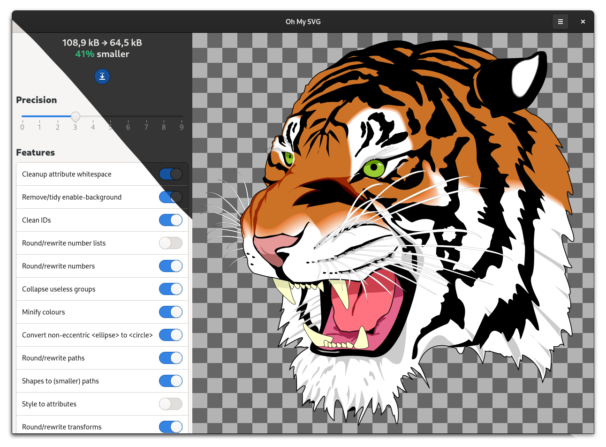

# Oh My SVG

Reduce the size of SVGs



<a href='https://flathub.org/apps/details/re.sonny.OhMySVG'></a>

## About

Oh My SVG let you export unoptimized SVG files into smaller versions.

Under the hood, it uses [SVGO](https://github.com/svg/svgo/) to remove or approximate information that is not required for rendering.

It lets you preview and tweak the parameters to obtain a satisfactory result before saving.

Remember that Oh My SVG removes information and metadata that may be useful, do not overwrite your original/source SVG files.

## Installation

[Setup flatpak](https://flatpak.org/setup/) then

```sh
flatpak install re.sonny.OhMySVG
flatpak run re.sonny.OhMySVG
```

## Roadmap

- better icon
- zoom in and out
- out of process svgo
  - toggling switches not smooth
  - block UI threads
- rasterize
  - Export to png
  - Export to webp
- UI
  - Filename as headedr bar subtitle
  - Already optimized 🎉
  - use libadwaita
  - basic/advanced plugins
- support drag'n drop file https://gitlab.gnome.org/GNOME/gtk/-/issues/3094
- support pasting file
- support copying file
- show original / compare original
- preview in browser
- compared gzipped

## Development

```sh
cd OhMySVG
./re.sonny.OhMySVG src/car-lite.svg
```

Make changes and hit `Ctrl+Shift+Q` on the window to restart the application.

To pass the tests you have to install a few dependencies

```sh
# Install development dependencies
sudo dnf install --assumeyes npm flatpak make desktop-file-utils gjs gtk4-devel
npm install
flatpak remote-add --user --if-not-exists flathub https://flathub.org/repo/flathub.flatpakrepo
flatpak install --user --assumeyes --noninteractive flathub org.freedesktop.appstream-glib

# Run tests
make test
```

Flathub builds https://flathub.org/builds/#/apps/re.sonny.OhMySVG

## Building

<details>
  <summary>host</summary>

```sh
meson --prefix $PWD/install build
ninja -C build install
```

</details>

<details>
  <summary>Flatpak</summary>

Use [GNOME Builder](https://wiki.gnome.org/Apps/Builder) or

```sh
flatpak-builder --user --force-clean --install-deps-from=flathub --install flatpak re.sonny.OhMySVG.yaml
```

</details>

## Credits

Oh My SVG is powered by [SVGO](https://github.com/svg/svgo) and inspired by [SVGOMG](https://github.com/jakearchibald/svgomg).

## License

GPLv3 or later. Please see [COPYING](COPYING) file.
